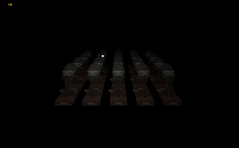

# Portfolio

## Education
- Game Development: Programming Major, Luleå University of Technology (2021-2024)
  * About: Learned programming languages such as: C++, Python, C#, Angelscript, with a focus on C++. Created games, software, graphics and physics engines using tools such as: Unity, Unreal Engine, OpenGL. Experience working with real customers/project managers to develop their product. Theoretical and practical experience working with agile methodology, specifically Scrum.
  * Additional Courses: Game Design, and Introduction to Artificial Intelligence.
- Network Technology, Mälardalens University (2018-2019)

## Previous Jobs.
None in this field.

## Skills

### Proficient Programming Languages:
- **C++**

### Other Programming Languages:
- **C**
- **Python**
- **Angelscript**

### Game Engines & APIs:
- **Unreal Engine**
- **Unity**
- **OpenGL**

### Development Tools:
- **Visual Studio**
- **Visual Studio Code**
- **GitHub**
- **Perforce**
- **Helix Swarm**
- **Hansoft**
- **FL Studio**
- **RenderDoc**
- **CMake**

## Projects
### Bobby
<iframe width="560" height="315" src="https://www.youtube.com/embed/YKkjFaRAAGY" frameborder="0" allowfullscreen></iframe>

- **About**
  - "Bobby" is the result of a collaboration between the third-year game programming and art students at Luleå University of Technology (LTU). Bobby is a vertical slice of a stop-motion mystery game created in UE5 and is set in a small town, evocative of early 1900s London. The narrative centers on a bedridden girl whose sister has been missing for several weeks. Desperate to find her sister but unable to leave her bed, the girl imagines her favorite toy, Bobby the toy police officer, embarking on the search in her stead. Although Bobby isn't truly alive, he embodies the girl’s fervent hope that someone will find her sister.

    In the game, players control Bobby as he explores the town, gathering clues about the sister's disappearance. During his investigation, Bobby uncovers evidence of some kind of creature. Thinking that this creature might have something to do with the sister's disappearance, he follows the trail of clues in hope that he might uncover the truth.

- **My Job: Gameplay Programmer**
  - I primarily collaborated with a small team of two other programmers and closely worked with a group from the art team. Our task was to implement the town square, where the boss fight takes place, as well as the fight itself. The project was organized using sublevels, with the town square being one of them.

    **Boss and Minion Behavior:** I was responsible for creating the behavior for the boss and the slime minions that spawn during the fight. I implemented a finite-state machine (FSM) for this purpose. This could have been done with a behavior tree. However, we wanted to use Angelscript as much as possible instead of visual scripts like blueprints or in this case, behavior trees.

    **Boss Behavior:** The boss had various attack states that it could choose from based on the distance and position of Bobby. Other states included popping up from manholes during the initial phase and moving between manholes.
    
    **Minion Behavior:** The minions had simplified states compared to the boss, consisting of idle/wander, chase, and attack states.

    **Boss System:** I developed a subsystem that mimicked the singleton pattern, known as the "boss system". This system was crucial for managing different phases of the boss fight and controlling the flow, such as determining the number of tentacles that would spawn at certain times.

    **Version Control and Code Review:** We used a combination of Perforce and Helix Swarm for storing project data and code review.
    
    **Project Planning:** Hansoft was utilized for planning and check the status of tasks and milestones. Working in an agile environment, we held daily meetings where we discussed what needed to be done for the day and if any new problems had came to light from the day before. Weekly scrum planning were held to plan what we needed to get done that week to meet the milestone.
    
    **Programming Language:** The project was programmed using Angelscript.
 
### Turn the Tide
<iframe width="560" height="315" src="https://www.youtube.com/embed/Czm_HKpNagA" frameborder="0" allowfullscreen></iframe>

- **About**
  - "Turn the Tide" was the first game I created during my first year at Luleå University of Technology (LTU). Developed alongside three other team members.

    Turn the Tide is a two-player, turn-based strategy game set in the waters of the Caribbean. Players control pirate ships, navigating the waters to collect treasure chests. These chests reward players with power-up cards that can be used in battles or for strategic advantages, such as better field coverage. The cards can be combined with basic navigation to position your ship perfectly before deploying a power-up. The objective is to be the last ship sailing, outmaneuvering and outsmarting your opponent to victory.
 
- **My Job: Gameplay Programmer**
  - During this project, I had the opportunity to work on various aspects, including movement, shooting mechanics, map generation, power-ups, and particle effects. Our primary tools were GitHub for version control, Unity for development, and MS Paint for creating UI art. Most of the assets were sourced from Kenney, with the exception of the UI elements, which we created ourselves.

    **Movement Implementation** To handle movement, I implemented a 2D array to represent the game board. Each cell in the array was assigned an integer to denote different elements like walkable areas, islands, and player positions. Treasure chests, however, were managed differently. Instead of representing them in the array, we used collision boxes that triggered interactions when a ship or cannonball entered their boundaries. This allowed ships to pick up treasure chests and cannonballs to destroy them.

    **Map Generation** For map generation, I implemented a system that randomized the 2D array to place islands and treasure chests. After setting up the array, objects were spawned at the appropriate locations. To ensure balanced gameplay, we introduced a limit on the number of islands and treasure chests that could spawn, which players could adjust before starting a match.

    **Shooting Mechanics** The shooting mechanics were developed using Unity's physics engine. By adding force and gravity to the cannonballs, we simulated realistic trajectories. After fine-tuning, we ensured that cannonballs traveled exactly three cells on the board. Additionally, collision boxes on the cannonballs detected impacts, triggering the corresponding particle effects to enhance the visual experience.

    **Tools and Technologies** We used GitHub for version control to manage our codebase efficiently. Unity was our main development platform, providing a robust environment for implementing game mechanics and visual effects. For UI art, we relied on MS Paint, while most game assets were downloaded from Kenney, except for the UI elements, which were custom-made by a person from our team.

### Test Track

- **About**
  - "Test Track" was developed in collaboration with four other students at Luleå University of Technology (LTU) at the request of Colmis Proving Ground. Using UE5, we created a realistic car simulator that allowed users to experience driving on one of their race tracks in Arjeplog, Sweden, from the comfort of their homes.

    To ensure the simulation's realism, we used a 3D megascan of a section of their actual track, provided by the project owner. By incorporating ice into the track, we created a more accurate driving experience, which could be further customized by adjusting tire grip to match different cars.

- **My Job: VFX Artist**
  - I was responsible for creating the different weather conditions in the simulator. The three weather types implemented were clear, snowing, and foggy. Using the Niagara System provided by UE5, I created the snow particles and through Blueprints, I made a simple system to swap between the various weather conditions. For performance optimization, the particle emitter was attached to the car, ensuring that particles like snowflakes were only emitted in the vicinity of the vehicle.

    We used GitHub for version control, employing different branches for code reviews before merging changes into the main branch. The programming language used for this project was Angelscript. Additionally, we held weekly meetings over Discord with the project owner to ensure our work aligned with their expectations and to plan our tasks for the upcoming week.

### OpenGL Game Engine

- **About**
  - This is my first attempt on making my own game engine using OpenGL. I began this project during my 2nd year at LTU where I developed the rendering pipeline including shaders, lighting, OBJ/GLTF loading, and different rendering techniques. There is still some work to do with the rendering, but I'm planning to then move on to implementing physics which I have some experience in as I have a separate physics engine I've been working on.

    The bulk of the code can be found inside the "/.engine/render" and "/.engine/core" folder. Shaders are located in "/.assets/shader". Link to the repo: [Game Engine Link](https://github.com/maxeyz/OpenGL_Engine)
